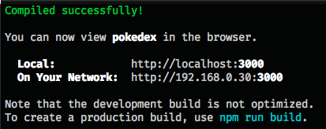
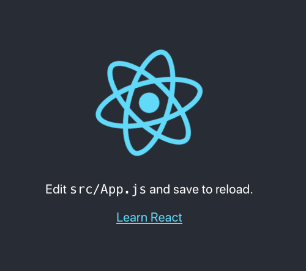

# Creating a React app

The Facebook team behind React have created a tool to help you create and set up React projects. It is called [Create React App](https://create-react-app.dev/). The official documentation is available [here](https://create-react-app.dev/docs/getting-started).

Install & set up a Create React App by following the steps below:

1. Open your terminal and `cd` to where you keep your projects
2. In your terminal, run:

```
npx create-react-app pokedex
```

(Note: for the React module lessons, you should name your app `pokedex`, but if you are creating another app, you can name it whatever you like.)

3. Then run:

```
cd pokedex
```

4. Open the `pokedex` folder in your editor. Notice that create-react-app has created a bunch of folders for you.

## Starting the app

To start running your application follow the steps below:

1. Open your terminal and `cd` to the `pokedex` folder we created previously
2. In your terminal, run:

```
npm start
```

This does two things:

1. Run a program on your computer that *watches* your files and updates your application when you make changes. It also runs some checks for common bugs or problems in your code. An error message will be shown in your browser if it detects that there is a problem. When it has started it looks like this:



2. Opens a web browser with a link to your React app so that you can develop and test the changes you made. You should see a big rotating React logo:



## Stopping the app

You might notice that once you have run `npm start` your terminal will look different. This is because it is running the *watcher* program. If you have a slower computer we recommend that you *stop* the program when you are not using your React app.

To stop the program, open your terminal and press `Ctrl-C` (it's the same on Windows, Mac & Linux). Unfortunately, closing your terminal will **not** stop the program from running.

Once you have stopped running the program, your React app **will stop working**. To start it again, see the instructions above for starting your app.

## Installing stop-runaway-react-effects

We also need to install another package that will help us later in the React module.

To install it, follow these steps:

1. Ensure that the React app is **not** running, by following the instructions above
2. Open your terminal and ensure that you are within the `pokedex` folder
3. Then run in your terminal: `npm install stop-runaway-react-effects`
4. Once this has this finished, open the `src/index.js` file in your editor. Don't worry about understanding the code in this file, we'll learn about it later.
5. Add an extra line **at the top of the file** with this code: `import 'stop-runaway-react-effects/hijack';`. If it is not on **line 1** of the file, it will **not** work
6. Start the app again (by following the instructions above) to check that it still works
